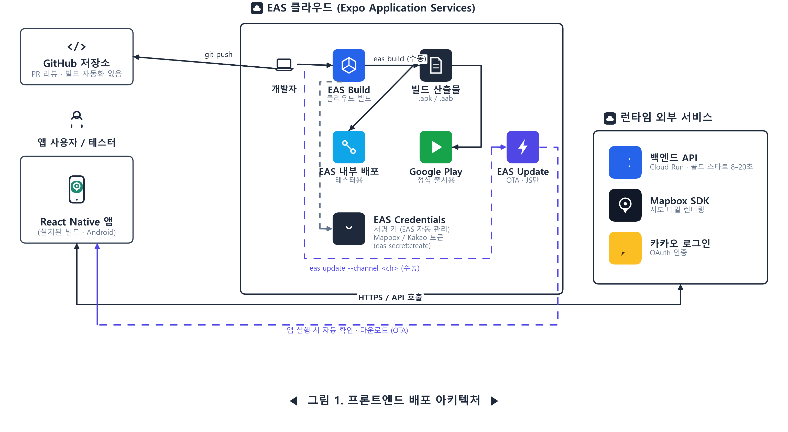

# 배포 아키텍처

> 상태: `eas.json`, `app.config.ts`, `package.json`, `.github/workflows` 및 `deploy/eas-update-ota` 브랜치(2026-09-20) 기준
> OTA(EAS Update) 설정은 `deploy/eas-update-ota` 브랜치에서 들어왔다 — `dev` 병합 여부는 GitHub에서 직접 확인할 것.
> 로컬 개발 환경 세팅(.env, Dev Client 설치 등)은 [ONBOARDING.md](../ONBOARDING.md) 참고 — 이 문서는 "빌드·배포"만 다룬다.



개발자 로컬에서 GitHub(코드 리뷰) · EAS Build(네이티브 빌드) · EAS Update(OTA) 세 곳으로 각각 수동 명령을 실행한다. EAS Build 산출물은 내부 배포(테스터용)와 Google Play 제출(사용자용) 두 경로로 기기에 설치되고, EAS Update는 그렇게 이미 설치된 앱에게 네이티브 재빌드 없이 JS/에셋만 바로 전달한다 — 앱이 실행될 때마다 자동으로 확인·수신한다.

---

## 0. 핵심 사실

1. **자동 빌드 파이프라인 없음.** GitHub Actions는 `pr-labeler.yml`만 동작 — 빌드·배포는 전부 개발자가 로컬에서 아래 명령들을 수동 실행해야 한다.
2. ⚠️ **OTA(EAS Update)는 설정됐지만, 다음 빌드부터 적용된다.** `expo-updates` 설치 + `runtimeVersion.policy: fingerprint` 구성은 완료. 지금 이미 배포돼있는 빌드들은 이 기능이 없어서, 한 번은 반드시 새로 빌드해야 그 이후부터 OTA를 받는다.
3. **OTA와 재빌드, 기준은 "네이티브를 건드렸는가".** JS·텍스트·에셋만 고쳤으면 `eas update`. 새 라이브러리·권한·SDK 버전을 건드렸으면 무조건 재빌드 — fingerprint 런타임 버전이 자동으로 갈라져서 안 맞는 조합은 거부된다.
4. **현재는 Android만 구축됨.** `app.config.ts`에 iOS `bundleIdentifier`만 지정돼 있고 `ios/` 폴더 자체가 없다 — iOS 빌드 프로파일은 아직 없음.
5. **백엔드 콜드 스타트에 유의.** Cloud Run이 scale-to-zero라 첫 요청이 8–20초 걸릴 수 있음 — 앱은 `useCachedResource` 훅으로 이를 완화하고 있음.
6. ⚠️ **시크릿도 두 종류다.** `EXPO_PUBLIC_` 접두사 붙은 값(API 주소, Mapbox·Kakao 키)은 앱 JS 번들에 그대로 박혀서 실행 중 서버 통신에 쓰인다 — 진짜 비밀은 아니고 빌드 결과물 안에 노출돼 있다. 접두사 없는 값(`RNMAPBOX_MAPS_DOWNLOAD_TOKEN` 등)은 빌드할 때만 쓰고 앱엔 안 실린다. 서명 키는 EAS가 별도 관리, 나머지는 `eas secret:create`로 EAS 서버에 저장 — 로컬 개발용 값만 각자 `.env`에 둔다.

---

## 1. 사전 준비 (한 번만)

```bash
npx eas-cli login          # chimaekmeeting 조직 계정으로 로그인
npx eas-cli whoami          # chimaekmeeting 뜨면 정상
```

멤버가 아니면 조직 관리자(`kuty2004`)에게 초대 요청.

## 2. 시나리오별 명령어

### 2.1 테스터 공유 — 네이티브든 JS든, 테스터에게 새 버전 보내고 싶을 때

```bash
eas build --profile production-apk --platform android
```

빌드 끝나면 터미널/Expo 대시보드에 뜨는 설치 링크·QR을 테스터에게 공유. 스토어 심사 없음, 보통 몇 분~십수 분.

### 2.2 정식 출시 — Google Play 정식 버전으로 올릴 때

```bash
eas build --profile production --platform android
eas submit --profile production
```

빌드 먼저, 끝나면 제출. 제출 후 Play 심사 대기(보통 몇 시간~며칠) — 이 구간은 자동화 불가능, EAS와 무관한 구글 쪽 절차.

### 2.3 OTA (가장 빠름) — 네이티브 코드는 안 건드리고 JS/텍스트/에셋만 고쳤을 때

```bash
eas update --channel production --environment production --message "설명"
```

새 빌드도, 스토어 재심사도 필요 없음 — 이미 배포된 앱이 다음 실행 시 자동으로 받아감. 테스터 채널로 보내려면 `--channel production-apk`로 바꾸면 됨.

> ⚠️ 새 네이티브 모듈 설치, `app.config.ts`의 `plugins`·권한 변경, RN/Expo SDK 업그레이드 등을 했다면 이 명령 쓰면 안 됨 — 2.1/2.2로 새 빌드부터 해야 한다. (runtimeVersion이 fingerprint 정책이라 안 맞으면 앱이 알아서 무시하긴 하지만, 처음부터 구분해서 판단하는 게 안전함.)

배포 후 확인: `eas channel:list`로 채널이 최신 업데이트를 가리키는지 확인 가능. "환경 변수를 찾을 수 없다"는 에러가 나면 `eas env:list --environment production`으로 EAS 대시보드 쪽 환경변수가 설정돼 있는지 먼저 확인.

## 3. 시크릿 — 키·토큰은 어디 있고 어떻게 다루나

| 종류 | 보관 위치 | 확인/추가 명령 |
|---|---|---|
| Android 앱 서명 키 | EAS 서버 (EAS-managed credentials) | `eas credentials` |
| Mapbox / Kakao 토큰 등 | EAS 프로젝트 시크릿 | `eas secret:create` / `eas secret:list` |
| 로컬 개발용 값 | 각자 `.env` (git에 없음) | `.env.example` 참고 |

## 4. 빌드 프로파일 ↔ 채널 (`eas.json`)

| 프로파일 | 용도 | OTA 채널 |
|---|---|---|
| `development` | 디버그 Dev Client, 내부용 | `development` |
| `production-apk` | 내부 배포용 APK (스토어 미경유) | `production-apk` |
| `production` | app-bundle(`.aab`), 스토어 제출용 | `production` |

---

## 5. 런타임 외부 의존성

설치된 앱은 배포 경로와 무관하게 항상 같은 세 서비스와 통신한다.

| 서비스 | 용도 | 관련 env |
|---|---|---|
| 백엔드 API (Cloud Run) | 산책 경로 추천 등 핵심 로직. scale-to-zero라 콜드 스타트 8–20초 | `EXPO_PUBLIC_API_BASE_URL` |
| Mapbox SDK | 지도 타일 렌더링 | `EXPO_PUBLIC_MAPBOX_PUBLIC_ACCESS_TOKEN`(런타임) / `RNMAPBOX_MAPS_DOWNLOAD_TOKEN`(빌드 전용, SDK 다운로드용) |
| 카카오 로그인 | OAuth 인증 | `EXPO_PUBLIC_KAKAO_NATIVE_APP_KEY` |
